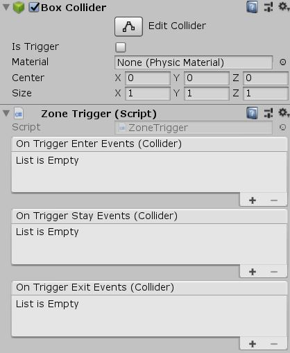

# Unity-Trigger
Contains a collection of module to facilitate triggers.

Require a Collider(2D) to works.

*Can be attach with Component --> UniCraft --> Trigger --> X*

# Information

Tested on Unity **2018.1.2f1** & **2018.3.0b**

Version **1.0.1**

# Screenshots

# License

MIT License